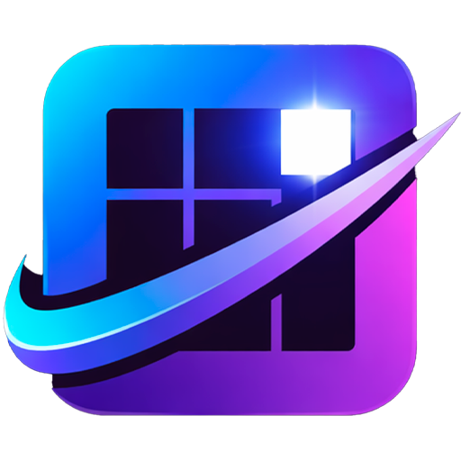

<div align="center">
  
</div>

<h1 align="center">Nexa</h1>

<p align="center">
  <a href="https://github.com/Envo1d/media-viewer/releases/latest"></a>
  <a href="https://github.com/Envo1d/media-viewer/releases/latest"></a>
  <a href="LICENSE"></a>
  
</p>

<p align="center">
  A fast, native Windows media library manager.<br>
  Browse, tag, and organize thousands of images and videos with ease.
</p>

---

## Screenshots

> *Screenshots coming soon.*

---

## Features

- 🖼️ **Beautiful grid view** — smooth thumbnail browsing no matter how large your library is
- 🔍 **Instant search** — find anything by name, artist, character, or tag in milliseconds
- 🏷️ **Rich metadata** — assign copyright, artist, characters, and tags to any file
- 📥 **Staging inbox** — drop new files into a separate folder, then distribute them to your library in one click
- 📂 **Auto-sync** — changes made outside the app (new files, renames, deletes) appear automatically
- 🔢 **Smart sorting** — natural filename order so `file2` always comes before `file10`
- 🖱️ **Multi-select** — select files with a drag or Ctrl+click, then act on all of them at once
- 🔄 **Auto-update** — Nexa checks for new versions and updates itself in the background

---

## Installation

<a href="https://github.com/Envo1d/media-viewer/releases/latest"></a>

Download `Nexa.exe` from the [latest release](https://github.com/Envo1d/media-viewer/releases/latest) and run it.
No installer, no setup — just a single file.

> ⚠️ **Windows 10 or 11 required.**

---

## Getting Started

1. Launch `Nexa.exe`
2. Click the **Settings** icon in the title bar
3. Under **Library**, choose your media folder
4. Hit **Scan now** — Nexa will index everything automatically
5. *(Optional)* Set up a **Staging folder** as an inbox for new incoming files

---

## Build from Source

```bash
# Requires: Rust stable (https://rustup.rs) on Windows
git clone https://github.com/Envo1d/media-viewer.git
cd media-viewer
cargo build --release -p Nexa
# Output: target/release/Nexa.exe
```

---

## Bug Reports

Found something wrong? Please open an issue in [GitHub Issues](https://github.com/Envo1d/media-viewer/issues).

---

## License

Nexa is released under the [MIT License](LICENSE).

---

<p align="center">
  If you find Nexa useful, consider giving it a ⭐ — it helps a lot! ❤️
</p>
